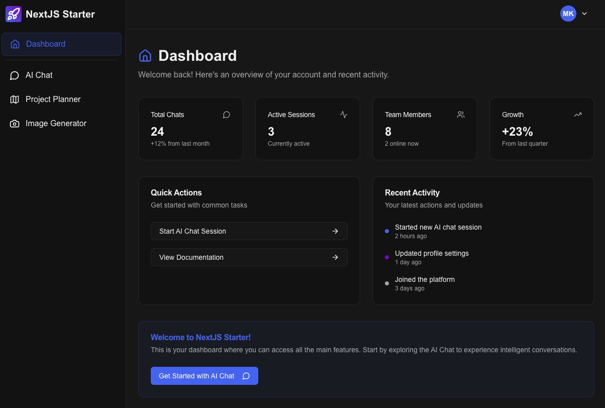

# ENova Jumpoff Template 🚀

A production-ready, full-stack Next.js SaaS starter template with authentication, payments, database, AI integration, and email marketing built-in. Start building your next SaaS product in minutes, not weeks.



## 🎯 What is This?

ENova Jumpoff Template is a battle-tested, production-ready starter template that includes everything you need to launch a modern SaaS application. It's designed to save you weeks of setup time and let you focus on building your unique product features.

**Perfect for:**
- SaaS products and web applications
- AI-powered applications
- Subscription-based services
- MVP development
- Hackathons and rapid prototyping

## ✨ Features

### 🔐 Authentication & User Management
- **Clerk** - Fully integrated authentication system
- Pre-built sign-in/sign-up pages with beautiful UI
- User profile management
- Webhook integration for automatic database sync
- Protected routes with custom middleware

### 💳 Payments & Subscriptions
- **Stripe** - Complete payment processing
- Subscription management (monthly/yearly plans)
- Multiple pricing tiers
- Webhook integration for subscription events
- Billing portal integration
- Automatic subscription status syncing

### 🗄️ Database
- **Supabase** - PostgreSQL database with Row Level Security
- Pre-configured database schema
- Service role access pattern for secure operations
- Real-time data syncing from webhooks

### 🤖 AI Integration
- **OpenAI** - Ready to use AI features
- Built-in AI chat interface
- Token usage tracking
- Streaming responses

### 📧 Email Marketing
- **MailerLite** - Email automation and lead management
- Newsletter subscription API
- Lead magnet integration ready
- Automated email campaigns support

### 🎨 UI & Design
- **Radix UI** - Accessible, high-quality UI primitives
- **shadcn/ui** - Beautiful, customizable components
- **Tailwind CSS** - Utility-first styling
- Dark/light theme with `next-themes`
- **Lucide React** - Modern icon library
- Responsive design out of the box
- Animated components with Framer Motion

### 🛠️ Developer Experience
- **TypeScript** - Full type safety
- **Next.js 15.3.3** - Latest App Router
- **React 19.1.0** - Cutting edge features
- **Turbopack** - Lightning-fast dev builds
- **ESLint** - Code quality and consistency
- **Zod** - Schema validation
- Hot module replacement
- Comprehensive error handling

### ⚡ Infrastructure
- **Vercel** - Optimized for deployment
- **Vercel Cron Jobs** - Scheduled tasks built-in
- Serverless API routes
- Edge runtime support
- **ngrok** - Local webhook testing

### 📊 State Management
- **React Query (TanStack Query)** - Server state management
- Optimistic updates
- Automatic refetching
- Cache management

## 📦 Tech Stack Summary

| Category | Technology |
|----------|-----------|
| **Framework** | Next.js 15.3.3 |
| **Language** | TypeScript 5 |
| **Runtime** | React 19.1.0 |
| **Authentication** | Clerk |
| **Database** | Supabase (PostgreSQL) |
| **Payments** | Stripe |
| **AI** | OpenAI |
| **Email Marketing** | MailerLite |
| **UI Components** | Radix UI + shadcn/ui |
| **Styling** | Tailwind CSS |
| **Icons** | Lucide React |
| **State Management** | React Query |
| **Validation** | Zod |
| **Deployment** | Vercel |
| **Dev Tools** | Turbopack, ESLint |

## 🚀 Quick Start

### Prerequisites

Make sure you have the following installed:
- **Node.js** 18+ ([Download](https://nodejs.org/))
- **Git** ([Download](https://git-scm.com/))
- **ngrok** for webhook testing ([Download](https://ngrok.com/download))

### Installation

1. **Clone or download this repository**
   ```bash
   # Option 1: Clone from Git
   git clone https://github.com/yourusername/enova-jumpoff-template.git
   cd enova-jumpoff-template

   # Option 2: Download as ZIP
   # Extract the ZIP file and navigate to the directory
   ```

2. **Install dependencies**
   ```bash
   npm install
   ```

3. **Set up environment variables**
   ```bash
   cp .env.example .env.local
   ```
   Then fill in your API keys in `.env.local` (see [Setup Guide](#-complete-setup-guide) below)

4. **Start the development server**
   ```bash
   npm run dev
   ```

5. **Open your browser**
   Navigate to [http://localhost:3000](http://localhost:3000)

## 📚 Complete Setup Guide

### 1. Clerk Setup (Authentication)

1. Go to [clerk.com](https://clerk.com) and sign up
2. Create a new application
3. Copy your API keys from the dashboard:
   - `NEXT_PUBLIC_CLERK_PUBLISHABLE_KEY`
   - `CLERK_SECRET_KEY`
4. Set up the webhook (see Webhook Setup below)

**Webhook Setup:**
- Start ngrok: `ngrok http 3000`
- In Clerk Dashboard → Webhooks → Add Endpoint
- URL: `https://your-ngrok-url.ngrok-free.app/api/auth/webhook`
- Events: `user.created`, `user.updated`, `user.deleted`
- Copy the signing secret as `CLERK_WEBHOOK_SECRET`

### 2. Supabase Setup (Database)

1. Go to [supabase.com](https://supabase.com) and create a project
2. Copy your project URL and service role key:
   - `NEXT_PUBLIC_SUPABASE_URL`
   - `SUPABASE_SERVICE_ROLE_KEY`
3. Run the database schema:
   - Open SQL Editor in Supabase
   - Copy the contents from `docs/db-design.md`
   - Execute the SQL commands

### 3. Stripe Setup (Payments)

1. Go to [stripe.com](https://stripe.com) and sign up
2. Switch to Test mode
3. Get your API keys:
   - `NEXT_PUBLIC_STRIPE_PUBLISHABLE_KEY`
   - `STRIPE_SECRET_KEY`
4. Create your products and pricing:
   - Go to Products → Create Product
   - Create monthly and yearly plans
   - Copy the Price IDs for each tier
5. Set up webhook:
   - In Stripe Dashboard → Webhooks
   - URL: `https://your-ngrok-url.ngrok-free.app/api/payments/webhook`
   - Events: `customer.subscription.*`, `invoice.payment_*`
   - Copy signing secret as `STRIPE_WEBHOOK_SECRET`

### 4. OpenAI Setup (AI Features)

1. Go to [platform.openai.com](https://platform.openai.com)
2. Create an API key
3. Add to `.env.local` as `OPENAI_API_KEY`
4. Set up billing in your OpenAI account

### 5. MailerLite Setup (Email Marketing)

1. Go to [mailerlite.com](https://mailerlite.com) and sign up
2. Navigate to Integrations → API
3. Generate an API key
4. Create a group for your subscribers
5. Add to `.env.local`:
   - `MAILERLITE_API_KEY`
   - `MAILERLITE_GROUP_ID`

### 6. Vercel Deployment (Production)

1. Push your code to GitHub
2. Go to [vercel.com](https://vercel.com) and import your repository
3. Add all environment variables from `.env.local`
4. Deploy!
5. Update webhooks with your production URL

**Important:** After deployment, update your Clerk and Stripe webhook URLs to use your production domain instead of ngrok.

## 📁 Project Structure

```
enova-jumpoff-template/
├── src/
│   ├── app/                      # Next.js App Router
│   │   ├── api/                  # API routes
│   │   │   ├── auth/             # Clerk webhooks
│   │   │   ├── payments/         # Stripe webhooks
│   │   │   ├── newsletter/       # MailerLite integration
│   │   │   ├── cron/             # Scheduled jobs
│   │   │   └── ...               # Other API routes
│   │   ├── dashboard/            # Protected dashboard pages
│   │   ├── sign-in/              # Authentication pages
│   │   ├── sign-up/
│   │   ├── layout.tsx            # Root layout
│   │   └── page.tsx              # Landing page
│   ├── components/               # React components
│   │   ├── ui/                   # shadcn/ui components
│   │   └── landing/              # Landing page components
│   ├── lib/                      # Utility functions
│   │   ├── supabaseClient.ts    # Supabase client
│   │   ├── mailerlite.ts        # MailerLite utilities
│   │   └── utils.ts             # Helper functions
│   └── middleware.ts             # Auth middleware
├── public/                       # Static assets
├── docs/                         # Documentation
│   └── db-design.md             # Database schema
├── .env.example                 # Environment variables template
├── vercel.json                  # Vercel configuration (cron jobs)
├── tailwind.config.ts           # Tailwind configuration
├── next.config.ts               # Next.js configuration
└── package.json                 # Dependencies
```

## 🎨 Customization

### Brand Colors

Update your brand colors in [tailwind.config.ts](tailwind.config.ts):

```typescript
theme: {
  extend: {
    colors: {
      primary: {
        DEFAULT: 'hsl(var(--primary))',
        foreground: 'hsl(var(--primary-foreground))'
      },
      // ... customize other colors
    }
  }
}
```

### Logo & Images

1. Replace images in the `public/` directory
2. Update references in your components
3. Update the `favicon.ico`

### Landing Page

Customize the landing page components in [src/components/landing/](src/components/landing/)

### Database Schema

Review and modify the database schema in [docs/db-design.md](docs/db-design.md) to fit your needs.

## 🔧 Available Scripts

```bash
# Start development server with Turbopack
npm run dev

# Build for production
npm run build

# Start production server
npm start

# Run ESLint
npm run lint
```

## 🧪 Testing Webhooks Locally

1. **Start your development server:**
   ```bash
   npm run dev
   ```

2. **Start ngrok in a separate terminal:**
   ```bash
   ngrok http 3000
   ```

3. **Copy the ngrok URL** (e.g., `https://abc123.ngrok-free.app`)

4. **Update webhooks in Clerk and Stripe** with your ngrok URL

5. **Monitor webhook requests** at [http://localhost:4040](http://localhost:4040)

## 📈 Vercel Cron Jobs

The template includes a pre-configured cron job that runs daily at 2:00 AM UTC. Configure it in [vercel.json](vercel.json):

```json
{
  "crons": [
    {
      "path": "/api/cron/daily-sync",
      "schedule": "0 2 * * *"
    }
  ]
}
```

Use this for:
- Data synchronization
- Cleanup tasks
- Daily reports
- Scheduled emails

## 🔒 Security Best Practices

- ✅ All API keys are in environment variables
- ✅ Webhook signatures are verified
- ✅ Supabase Row Level Security (RLS) enabled
- ✅ Protected API routes require authentication
- ✅ CORS protection on sensitive endpoints
- ✅ Input validation with Zod
- ✅ TypeScript for type safety

## 🐛 Troubleshooting

### Webhook not receiving events
- Check that ngrok is running
- Verify webhook URLs in Clerk/Stripe dashboards
- Check webhook signing secrets match `.env.local`
- View webhook logs at [localhost:4040](http://localhost:4040)

### Database connection issues
- Verify Supabase URL and service role key
- Check that database tables are created
- Ensure RLS policies are configured

### Build errors
- Clear `.next` folder: `rm -rf .next`
- Delete `node_modules` and reinstall: `rm -rf node_modules && npm install`
- Check for TypeScript errors: `npm run lint`

## 📖 Documentation

- [Database Schema](docs/db-design.md) - Complete database design
- [Product Requirements](docs/product-requirements-doc.md) - PRD template
- [Next.js Docs](https://nextjs.org/docs)
- [Clerk Docs](https://clerk.com/docs)
- [Supabase Docs](https://supabase.com/docs)
- [Stripe Docs](https://stripe.com/docs)

## 🎯 What's Included?

- ✅ Complete authentication flow
- ✅ User dashboard with profiles
- ✅ Subscription management
- ✅ Payment processing
- ✅ Database with real-time sync
- ✅ AI chat interface
- ✅ Email newsletter integration
- ✅ Responsive design
- ✅ Dark/light theme
- ✅ Protected routes
- ✅ Webhook handlers
- ✅ Cron job setup
- ✅ Error handling
- ✅ Loading states
- ✅ Form validation
- ✅ Toast notifications

## 🚫 What's NOT Included?

This is a **starter template**, not a complete SaaS product. You'll need to add:
- Your specific business logic
- Custom features and functionality
- Your product's unique value proposition
- Additional pages and components
- Email templates
- Advanced analytics
- Custom integrations

## 💡 Tips for Using This Template

1. **Start with the landing page** - Customize it for your product
2. **Set up all integrations** - Follow the setup guide completely
3. **Test webhooks thoroughly** - Make sure all events are handled
4. **Customize the database schema** - Add your specific data needs
5. **Add your features** - Build on top of the foundation
6. **Keep it simple** - Don't over-engineer early on
7. **Test frequently** - Run the app after each major change

## 🤝 Contributing

This is a template for starting new projects. Fork it, customize it, and make it your own!

## 📄 License

This template is provided as-is for you to use in your projects.

## 🙏 Acknowledgments

Built with these amazing tools:
- [Next.js](https://nextjs.org/)
- [Clerk](https://clerk.com/)
- [Supabase](https://supabase.com/)
- [Stripe](https://stripe.com/)
- [OpenAI](https://openai.com/)
- [MailerLite](https://mailerlite.com/)
- [Radix UI](https://radix-ui.com/)
- [shadcn/ui](https://ui.shadcn.com/)
- [Tailwind CSS](https://tailwindcss.com/)

## 📞 Support

Need help getting started?
- Check the [documentation](docs/)
- Review the code comments
- Look at the example implementations
- Open an issue on GitHub

---

**Ready to build your SaaS?** 🚀

Start by running `npm install` and following the [Setup Guide](#-complete-setup-guide)!

Made with ❤️ by ENova
